# Premiere Night

A premium React Native application for discovering and curating films for private screening events. Built with bare React Native (no Expo) following luxury design principles and modern architecture patterns.

## 🎯 Overview

Premiere Night is a sophisticated mobile application that enables users to discover films, explore detailed information, and maintain a personalized watchlist. The app integrates with The Movie Database (TMDb) API to provide real-time film data, featuring a luxury minimalist design inspired by Apple and MyTheresa aesthetics.

### Core Concept

The application serves as a premium film discovery platform where users can:
- Browse curated film collections (Now Playing, Popular)
- Search for films in real-time
- View comprehensive film details
- Build and manage a personal watchlist
- Navigate seamlessly with deep linking support

## ✨ Features

### 1. Spotlight Home Screen
- **Vertical scrolling interface** with horizontal film carousels
- **Now Playing Carousel**: Displays currently playing films
- **Popular Carousel**: Shows trending popular films
- **Search functionality**: Real-time search with debounced queries
- **Loading states**: Elegant skeleton loaders during data fetching
- **Error handling**: Graceful error states with retry capabilities

### 2. Film Detail Screen
- **Comprehensive film information**: Poster, title, release date, genres
- **Synopsis**: Full film description
- **Watchlist integration**: Add/remove films from watchlist
- **Navigation**: Seamless navigation from carousels or search results
- **Deep linking support**: Direct navigation via `premiere://film/:filmId`

### 3. Watchlist Screen
- **Persistent storage**: Watchlist saved locally using AsyncStorage
- **Film management**: Add, remove, and toggle films
- **Empty states**: Elegant empty state when watchlist is empty
- **Error handling**: Robust error states with recovery options
- **Real-time updates**: Automatic UI updates when watchlist changes

### 4. Search Functionality
- **Real-time search**: Debounced queries for optimal performance
- **Client-side fallback**: Searches cached data if API fails
- **Search results carousel**: Horizontal scrolling results
- **Search state management**: Integrated with Redux for state persistence

### 5. Deep Linking
- **Custom URL scheme**: `premiere://film/:filmId`
- **Universal links**: `https://premiere-night.app/film/:filmId`
- **Navigation integration**: Seamless routing to film details

## 🏗️ Architecture

### Architecture Overview

Premiere Night follows a **layered architecture** with clear separation of concerns:

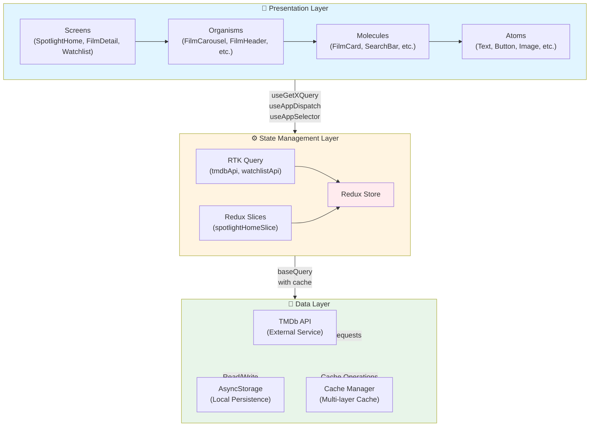

### Layer Interaction Flow

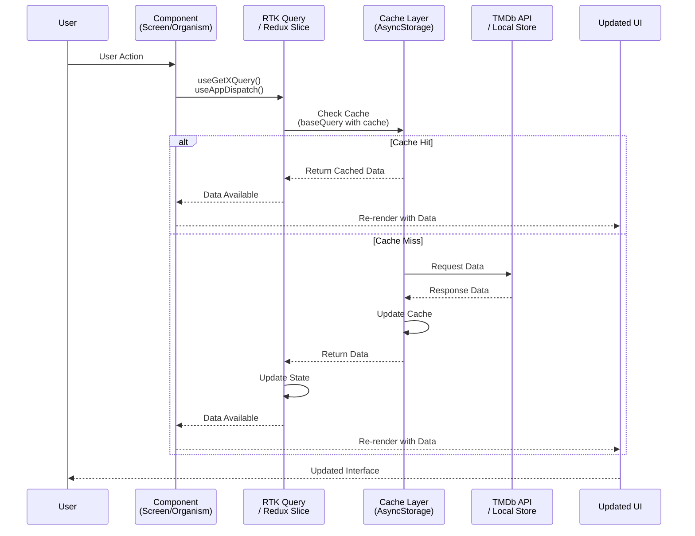

## 🎨 Design System & Architecture

### Atomic Design Pattern

The application follows **Atomic Design** principles for component organization:

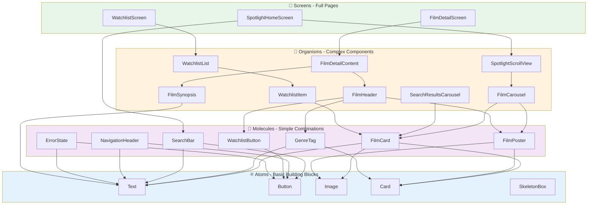

### Design Tokens

The app uses a centralized design system with tokens:

- **Colors**: Primary, secondary, tertiary text; accent (gold); backgrounds (primary, elevated)
- **Typography**: Display, headline, body, caption, label variants with consistent weights
- **Spacing**: Consistent spacing scale (xs → xxxl) for visual rhythm
- **Borders**: Light, medium, heavy variants for visual hierarchy

### Design Principles

- **Minimalism**: Clean, uncluttered interfaces with focus on content
- **Elegance**: Sophisticated typography and generous spacing
- **Refinement**: Subtle animations and premium color palette
- **Breathability**: Ample whitespace and clear visual hierarchy

## 🔧 Technical Architecture

### State Management: Redux Toolkit + RTK Query

**Decision**: Use Redux Toolkit with RTK Query for state management.

**Rationale**:
- **RTK Query**: Automatic caching, request deduplication, and optimistic updates
- **Redux Toolkit**: Simplified Redux with less boilerplate
- **Type Safety**: Full TypeScript support with generated hooks
- **Developer Experience**: Excellent DevTools integration
- **Scalability**: Proven architecture for complex applications

**Architecture Pattern**:
- **RTK Query for APIs**: All external API calls (TMDb) and local storage operations (watchlist)
- **Redux Slices for UI State**: Local component state (search query, UI flags)
- **No ViewModel Layer**: Components use RTK Query hooks directly for simplicity

**Implementation**:

```typescript
// RTK Query API Slice
export const tmdbApi = createApi({
  reducerPath: 'tmdbApi',
  baseQuery: baseQueryWithCache,
  endpoints: builder => ({
    getNowPlaying: builder.query<FilmListResponse, number | void>({...}),
    getPopular: builder.query<FilmListResponse, number | void>({...}),
    getFilmDetails: builder.query<Film, number>({...}),
    searchMovies: builder.query<FilmListResponse, { query: string }>({...}),
  }),
});

// Redux Slice for UI State
export const spotlightHomeSlice = createSlice({
  name: 'spotlightHome',
  initialState: { searchQuery: '', isSearchActive: false },
  reducers: {
    setSearchQuery: (state, action) => {...},
    clearSearch: state => {...},
  },
});
```

### Caching Strategy

**Multi-Layer Caching**:

1. **RTK Query Cache**: Automatic in-memory cache with configurable TTL
2. **AsyncStorage Cache**: Persistent cache layer for offline resilience
3. **Client-Side Search Fallback**: Searches cached data if API fails

**Cache Flow**:

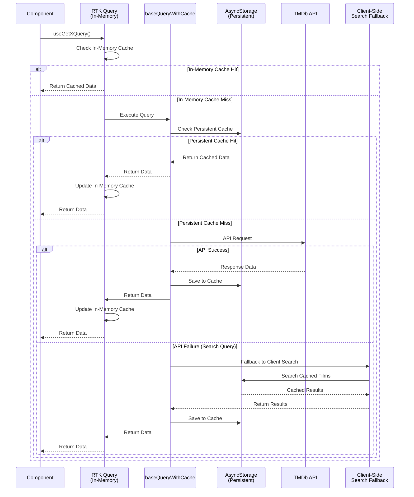

### Data Flow Architecture

```mermaid
flowchart TB
    subgraph ComponentLayer["📱 Component Layer"]
        Screen["Screen<br/>(SpotlightHomeScreen, etc.)"]
        Organism["Organism<br/>(FilmCarousel, etc.)"]
        
        Screen --> Organism
    end
    
    subgraph StateLayer["⚙️ State Management Layer"]
        Store["Redux Store"]
        RTKQuery["RTK Query<br/>tmdbApi<br/>watchlistApi"]
        ReduxSlice["Redux Slices<br/>spotlightHomeSlice"]
        
        RTKQuery --> Store
        ReduxSlice --> Store
    end
    
    subgraph DataLayer["💾 Data Layer"]
        TMDB["TMDb API<br/>(External)"]
        AsyncStorage["AsyncStorage<br/>(Local)"]
        Cache["Cache Manager"]
    end
    
    ComponentLayer -->|useGetXQuery()<br/>useAppDispatch()<br/>useAppSelector()| StateLayer
    StateLayer -->|baseQuery<br/>with cache| DataLayer
    DataLayer -->|HTTP Requests| TMDB
    DataLayer -->|Read/Write| AsyncStorage
    DataLayer -->|Cache Operations| Cache
    
    style ComponentLayer fill:#e1f5ff
    style StateLayer fill:#fff4e1
    style DataLayer fill:#e8f5e9
    style Store fill:#ffebee
```

### Navigation Architecture

**React Navigation** with type-safe navigation:

- **Stack Navigator**: Main navigation flow (HomeTabs → FilmDetail)
- **Tab Navigator**: Bottom tabs for main sections (Spotlight, Watchlist)
- **Deep Linking**: Custom URL scheme and universal links support

**Navigation Structure**:

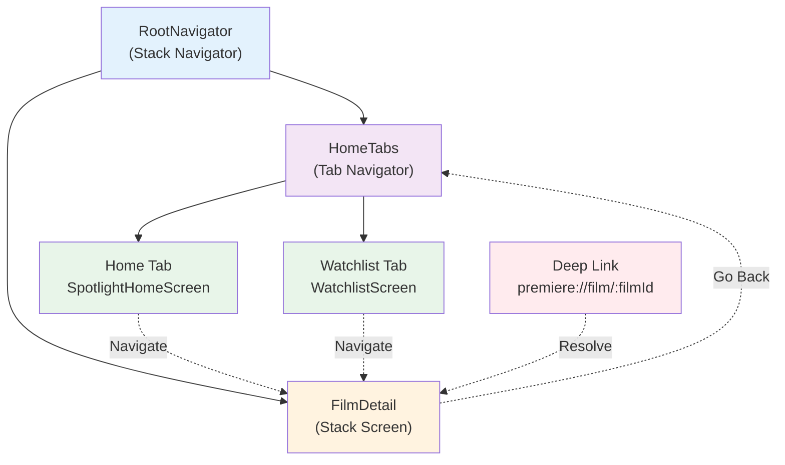

### Persistence Strategy

**AsyncStorage** for local data persistence:

- **Watchlist**: Stored in AsyncStorage with RTK Query abstraction
- **Cache**: Film data cached in AsyncStorage with versioning and TTL
- **Storage Abstraction**: Centralized storage service for consistency

**Persistence Flow**:

```mermaid
flowchart TD
    Start([User Action]) --> Action{Action Type}
    
    Action -->|Add to Watchlist| AddFlow[Add Film to Watchlist]
    Action -->|Remove from Watchlist| RemoveFlow[Remove Film from Watchlist]
    Action -->|View Watchlist| ViewFlow[Load Watchlist]
    
    AddFlow --> Mutation[useToggleFilmInWatchlistMutation]
    RemoveFlow --> Mutation
    ViewFlow --> Query[useGetWatchlistQuery]
    
    Mutation --> WatchlistAPI[watchlistApi<br/>RTK Query]
    Query --> WatchlistAPI
    
    WatchlistAPI --> BaseQuery[baseQueryWithStorage]
    BaseQuery --> Storage[AsyncStorage<br/>@premiere_night:watchlist]
    
    Storage -->|Read/Write| Data[(Film[] Array)]
    
    WatchlistAPI --> Invalidate[Invalidate Tags<br/>['Watchlist']]
    Invalidate --> Refetch[Auto Refetch<br/>Related Queries]
    Refetch --> Update[Update UI State]
    Update --> End([UI Updated])
    
    style AddFlow fill:#e8f5e9
    style RemoveFlow fill:#ffebee
    style ViewFlow fill:#e3f2fd
    style Storage fill:#fff3e0
    style Data fill:#f3e5f5
```

## 📂 Project Structure

### Component Dependency Graph

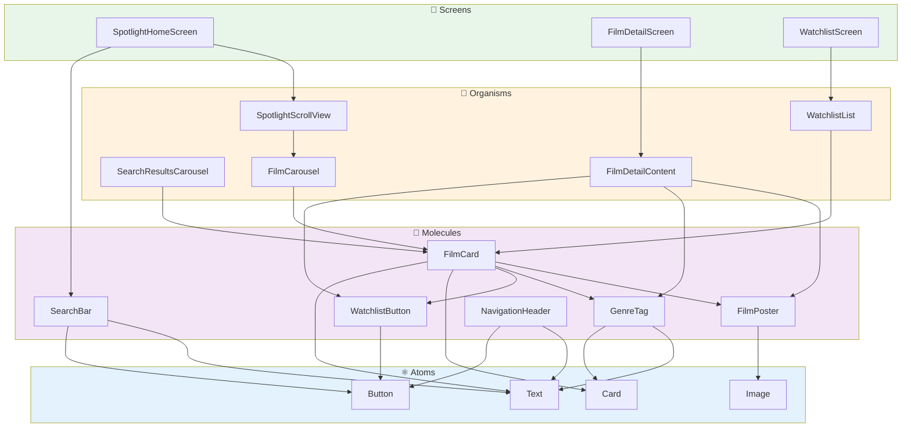

### Feature Flow: Add Film to Watchlist

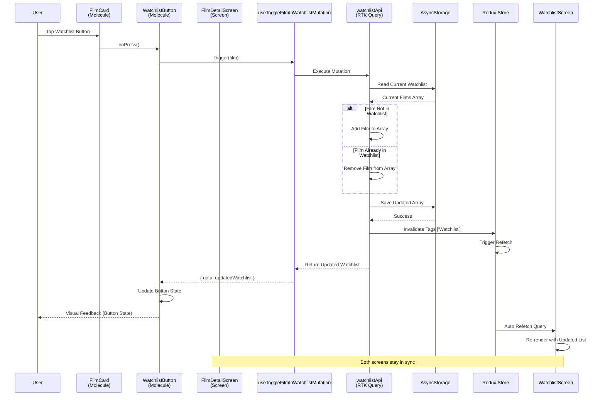

```
src/
├── components/              # Atomic Design components
│   ├── atoms/              # Basic building blocks
│   │   ├── Button/
│   │   ├── Card/
│   │   ├── Image/
│   │   ├── Text/
│   │   └── SkeletonBox/
│   ├── molecules/          # Simple combinations
│   │   ├── FilmCard/
│   │   ├── FilmPoster/
│   │   ├── GenreTag/
│   │   ├── SearchBar/
│   │   ├── NavigationHeader/
│   │   ├── WatchlistButton/
│   │   └── ErrorState/
│   └── organisms/          # Complex components
│       ├── FilmCarousel/
│       ├── FilmHeader/
│       ├── FilmSynopsis/
│       ├── FilmDetailContent/
│       ├── SearchResultsCarousel/
│       ├── SpotlightScrollView/
│       ├── WatchlistList/
│       └── WatchlistItem/
├── core/                   # Core utilities and infrastructure
│   ├── cache/             # Caching layer
│   │   ├── cache.ts       # Cache implementation
│   │   └── types.ts       # Cache types
│   ├── config/            # Configuration
│   │   └── tmdb.ts        # TMDb API configuration
│   ├── design/            # Design system
│   │   └── tokens/        # Design tokens (colors, typography, spacing)
│   ├── logger/            # Logging utilities
│   ├── storage/           # Storage abstraction
│   ├── store/             # Redux store configuration
│   │   ├── store.ts       # Store setup
│   │   └── hooks.ts       # Typed hooks
│   └── utils/             # Utility functions
│       └── tmdbImages.ts  # TMDb image URL helpers
├── navigation/            # Navigation configuration
│   ├── index.tsx          # Root navigator
│   └── linking.ts         # Deep linking configuration
├── screens/               # Screen components
│   ├── SpotlightHomeScreen/
│   ├── FilmDetailScreen/
│   └── WatchlistScreen/
├── store/                 # State management
│   ├── api/               # RTK Query API slices
│   │   ├── tmdbApi.ts     # TMDb API integration
│   │   └── watchlistApi.ts # Watchlist API (AsyncStorage)
│   └── slices/            # Redux slices
│       └── spotlightHomeSlice.ts # UI state
└── types/                 # TypeScript type definitions
    ├── components.ts
    ├── film.ts
    ├── navigation.ts
    └── screen.ts
```

## 🔄 Data Flow & State Management

### RTK Query Flow

**API Calls Flow**:

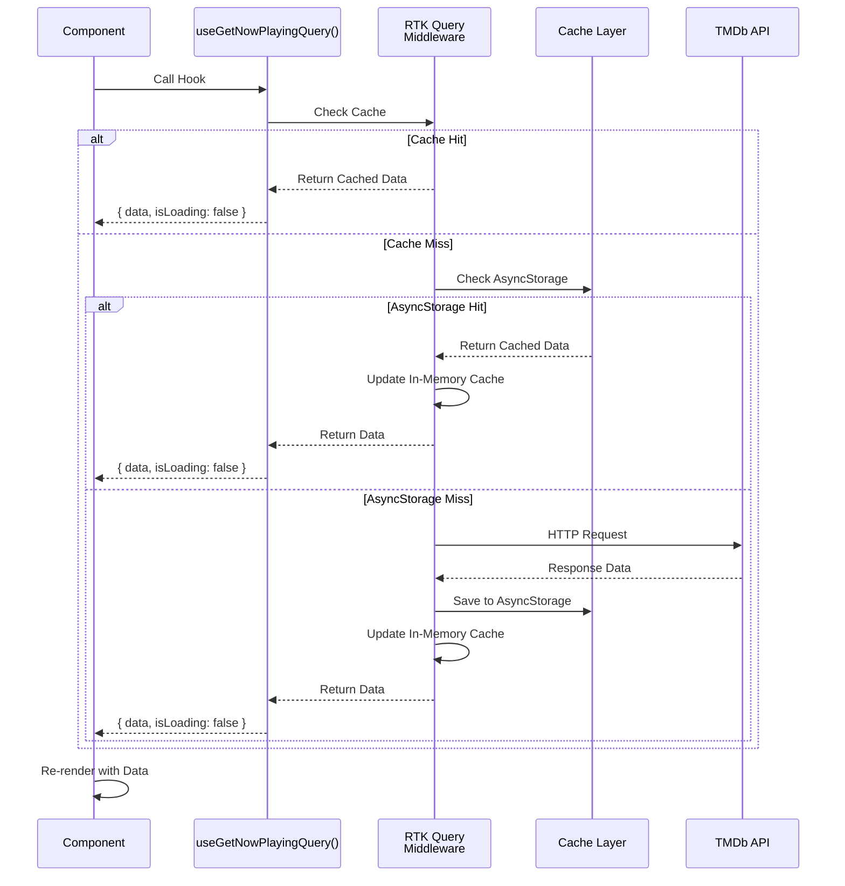

**Mutations Flow**:

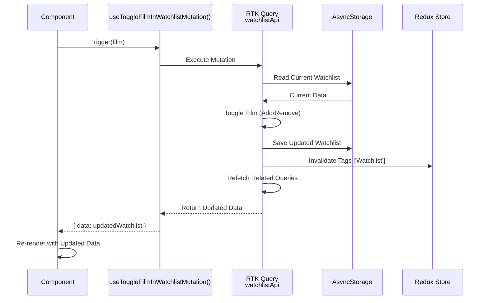

### Redux Slice Flow

**UI State Management**:

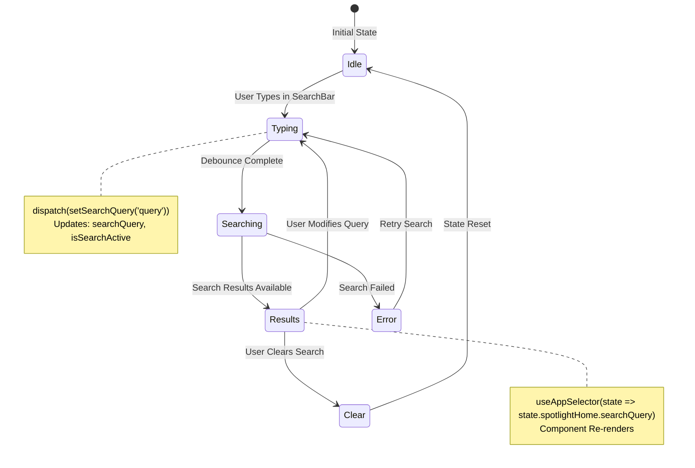

### Cache Strategy

**Multi-Level Caching Architecture**:

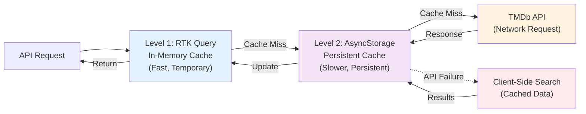

### Application State Management

**State Flow Diagram**:

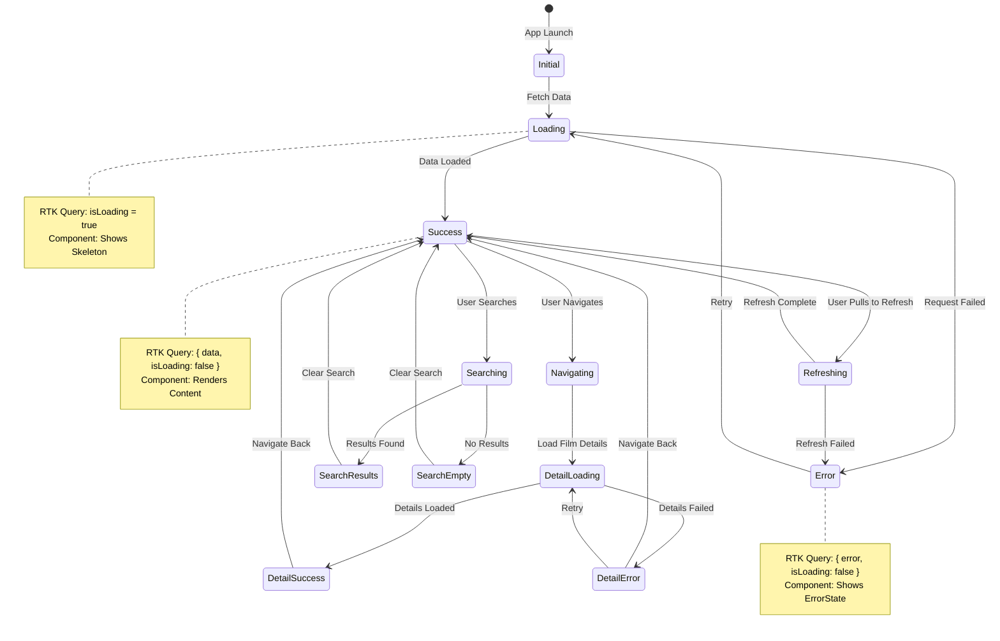

### RTK Query Endpoints Architecture

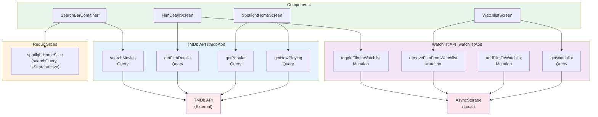

## 🛠️ Technology Stack

### Core Technologies
- **React Native**: 0.82.1 (bare workflow, no Expo)
- **React**: 19.1.1
- **TypeScript**: 5.8.3 (full type safety)
- **Redux Toolkit**: 2.11.0 (state management)
- **RTK Query**: Built-in (API calls and caching)
- **React Navigation**: 7.x (navigation)
- **AsyncStorage**: 2.2.0 (local persistence)

### Development Tools
- **Metro Bundler**: React Native bundler
- **ESLint**: Code linting
- **Jest**: Testing framework
- **TypeScript**: Type checking

### Design & Animation
- **React Native Reanimated**: 3.16.1 (animations)
- **React Native Gesture Handler**: 2.29.1 (gestures)
- **React Native Safe Area Context**: 5.5.2 (safe areas)

## 🚀 Getting Started

### Prerequisites

- **Node.js** >= 20
- **React Native CLI** (via `@react-native-community/cli`)
- **iOS**: Xcode 14+, CocoaPods, Ruby (for bundler)
- **Android**: Android Studio, JDK 17+, Android SDK
- **Package Manager**: pnpm (recommended)

### Installation

1. **Clone the repository**
   ```sh
   git clone <repository-url>
   cd PremierNight
   ```

2. **Install dependencies**
   ```sh
   pnpm install
   ```

3. **Configure environment**
   ```sh
   cp .env.example .env
   ```
   
   Add your TMDb API credentials to `.env`:
   ```
   TMDB_API_KEY=your_api_key_here
   TMDB_ACCESS_TOKEN=your_access_token_here
   ```
   
   Get your API key at [TMDb Settings](https://www.themoviedb.org/settings/api)

4. **Install iOS dependencies**
   ```sh
   cd ios && bundle install && bundle exec pod install && cd ..
   ```

### Running the App

1. **Start Metro bundler**
   ```sh
   pnpm start
   ```

2. **Run on iOS**
   ```sh
   pnpm run ios
   ```

3. **Run on Android**
   ```sh
   pnpm run android
   ```

## 🧪 Testing

Run tests with:
```sh
pnpm test
```

## 📝 Code Quality

- **TypeScript**: Full type safety throughout the application
- **ESLint**: Code linting configured
- **Early Returns**: Preferred pattern for cleaner code flow
- **Component Organization**: Atomic Design principles
- **Type Safety**: Strict TypeScript configuration

## 🔗 Deep Linking

The app supports deep links for navigating to specific films:

**Custom URL Scheme**:
```
premiere://film/:filmId
```

**Universal Links**:
```
https://premiere-night.app/film/:filmId
```

**Example**:
```
premiere://film/550
```

## 🎯 Key Architectural Decisions

### 1. Redux Toolkit + RTK Query over Zustand

**Decision**: Use Redux Toolkit with RTK Query instead of Zustand.

**Rationale**:
- RTK Query provides automatic caching and request deduplication
- Better ecosystem and community support
- Excellent DevTools integration
- Proven scalability for complex applications
- Unified state management (API + UI state)

### 2. Atomic Design Pattern

**Decision**: Organize components using Atomic Design.

**Rationale**:
- Clear component hierarchy and reusability
- Scalable structure for design system growth
- Aligns with luxury design principles
- Easy to maintain and extend

### 3. RTK Query for Local Storage

**Decision**: Use RTK Query for AsyncStorage operations (watchlist).

**Rationale**:
- Unified API pattern for all data operations
- Automatic cache invalidation
- Consistent error handling
- Type-safe hooks generation

### 4. Multi-Layer Caching

**Decision**: Implement caching at multiple levels (RTK Query + AsyncStorage).

**Rationale**:
- Performance optimization (fast in-memory cache)
- Offline resilience (persistent cache)
- Reduced API calls and bandwidth
- Better user experience

### 5. No ViewModel Layer

**Decision**: Components use RTK Query hooks directly.

**Rationale**:
- Simplicity: RTK Query already provides reactive hooks
- Less boilerplate: No need for intermediate layer
- Direct data flow: Components react to state changes automatically
- Easier to maintain: Fewer abstractions

### 6. Type-Safe Navigation

**Decision**: Use TypeScript for navigation type safety.

**Rationale**:
- Compile-time safety for navigation params
- Better developer experience with autocomplete
- Prevents runtime navigation errors
- Self-documenting code

## 🔄 Trade-offs & Assumptions

### Trade-offs Made

1. **No Offline-First Architecture**
   - **Assumption**: Users have internet connectivity
   - **Rationale**: Film discovery requires real-time data from TMDb
   - **Mitigation**: Caching layer provides some offline resilience

2. **Simple Search (No Advanced Filters)**
   - **Assumption**: Title search is primary use case
   - **Rationale**: Meets requirements, keeps scope manageable
   - **Future**: Could add genre/year/rating filters

3. **No Pagination for Carousels**
   - **Assumption**: Top 20 films per category is sufficient
   - **Rationale**: Sufficient for discovery, keeps UI simple
   - **Future**: Infinite scroll or "Load More" functionality

4. **Single Watchlist**
   - **Assumption**: Users want one unified watchlist
   - **Rationale**: Meets requirements, simple UX
   - **Future**: Multiple lists (e.g., "To Watch", "Watched")

5. **No User Authentication**
   - **Assumption**: Watchlist is device-local
   - **Rationale**: Out of scope, simplifies implementation
   - **Future**: Cloud sync with user accounts

### Assumptions

- **API Availability**: TMDb API is reliable and accessible
- **Data Quality**: TMDb provides complete film metadata
- **Performance**: Lists are small enough for FlatList without virtualization issues
- **Platform**: iOS and Android have similar UX requirements
- **Time Constraint**: Focus on core features with high quality over feature breadth

## 🚧 Known Limitations

1. **No Error Recovery UI**: Network errors require manual retry
2. **No Image Caching**: Posters reload on each screen visit
3. **No Pull-to-Refresh on Watchlist**: Only available on home screen
4. **Search Limited**: Only searches by title, no genre/year filters
5. **No Pagination**: Carousels show limited results

## 🔮 Future Enhancements

- **Image Caching**: Implement react-native-fast-image for poster caching
- **Offline Mode**: Enhanced offline support with cached data
- **Advanced Search**: Genre, year, and rating filters
- **Pagination**: Infinite scroll for carousels
- **User Authentication**: Cloud sync with user accounts
- **Film Recommendations**: Based on watchlist preferences
- **Share Functionality**: Share films with friends
- **Watchlist Categories**: Multiple lists (To Watch, Watched, etc.)
- **Film Reviews**: User reviews and ratings
- **Trailer Integration**: Video trailers for films

## 📄 License

This project is for recruitment purposes only.

## 🙏 Acknowledgments

- **TMDb API**: Film data and images
- **React Native Community**: Excellent tooling and libraries
- **Design Inspiration**: Apple.com and MyTheresa.com
